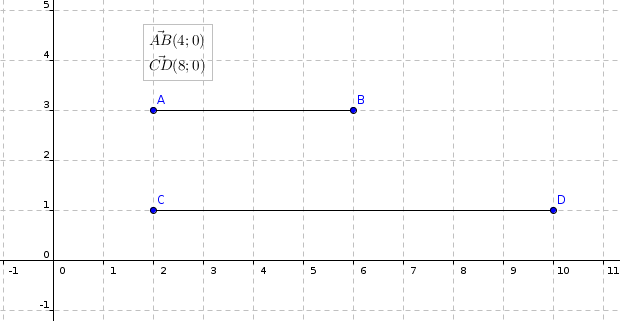
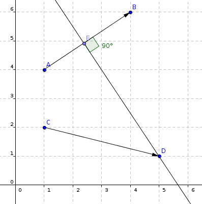
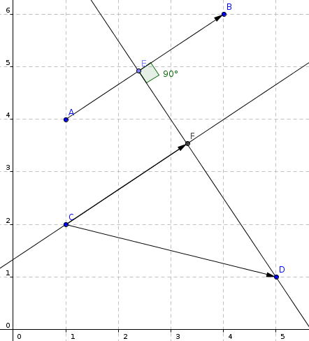
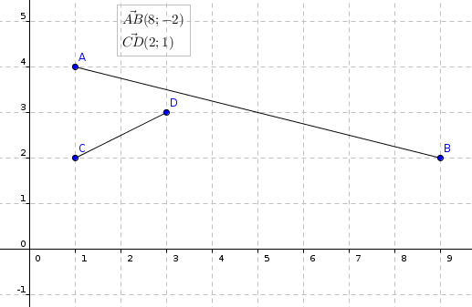
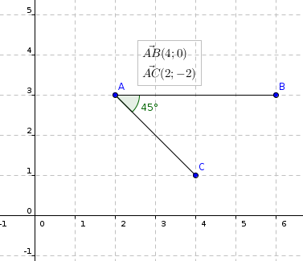
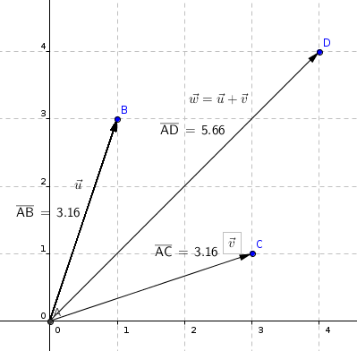

# Les produits scalaires

Ne soyez pas effrayé en entandant ce terme, les *produits scalaire* sont en réalité très simple à comprendre et à utiliser.

Il vous faut avoir des connaissances de base dans les vecteurs avant d'apprendre les produits scalaires.

Si vous souhaitez visionner un excellent cours très complet sur les vecteurs et les produits scalaires, je vous recommande l'intégralité de cette [vidéo YouTube](https://www.youtube.com/watch?v=gn_8Jt_t_BA).

## Qu'est-ce qu'un produit scalaire ?

Un **produit scalaire** n'est rien d'autre que le produit de deux vecteurs. Ce produit nous donnera toujours un nombre. Un produit scalaire s'écrit sous cette forme :
$$\vec{u} \cdot \vec{v}$$
Nous n'utilisons pas le signe $$\times$$ (multiplier) mais bien le $$\cdot$$ qui indique un produit scalaire. Ainsi, l'équation précédente se lit "*u scalaire v*".

## Les propriétés mathématiques des produits scalaires

Les produits scalaire, comme la multiplication ou n'importe quel autre élément mathématiques possèdent des propriétés. Celle-ci sont extrêmement simple, prenez le temps de les lire et de les comprendre, vous serez surpris de leur simplicité.

**Première propriété** : Tout comme les multiplications, les produits scalaires se distribuent. Par exemple dans une multiplication nous pouvons avoir ceci : 

$$a*(b+c) = a*b + a*c$$

Ce qui donne en pratique : 

$$3*(5+4) = 3*5 + 3*4$$

C'est la distributivité, rien de plus. Les produits scalaire fonctionnent de la même manière : 

$$\vec{a} \cdot (\vec{b} + \vec{c}) = \vec{a} \cdot \vec{b} + \vec{a} \cdot \vec{c}$$

**Seconde propriété** : On nomme cela *l'homogénéité*. Tout ce qu'il y a à retenir à propos de ceci est que l'on peut déplacer un nombre aisément dans une équation de ce type :

$$\vec{b} \cdot (a * \vec{c}) = a * (\vec{b} \cdot \vec{c})$$

Sachant que $$a$$ est un nombre. Cela peut être pratique pour résoudre ce type d'équation, car au final vous n'avez plus qu'à appliquer un coefficient au résultat d'un produit scalaire.

**Troisième propriété** : Admettons $$\vec{u} \cdot \vec{u}$$. Ceci n'est rien d'autre que $$||\vec{u}|| * ||\vec{u}$$ ! Donc cette propriété nous donne l'équation :

$$\vec{u} \cdot \vec{u} = \vec{u}^2 = ||\vec{u}|| * ||\vec{u}|| = ||\vec{u}||^2$$

**Quatrième propriété** : Avec les trois précédentes propriétés, nous pouvons déduire d'autres propriétés. En effet, les identités remarquables fonctionnent aussi avec les produits scalaires.

$$(\vec{u} + \vec{v})^2 = ||\vec{u}||^2 + 2 (\vec{u} \cdot \vec{v}) + ||\vec{v}||^2$$

## Comment calculer un produit scalaire ?

En fonction des données que vous possédez, voici les différentes manières de calculer un produit scalaire de deux vecteurs.

### Avec des vecteurs colinéaires

#### La théorie

C'est le cas le plus simple. Supposons que nous avons une force $$\vec{F}$$ et un vecteur $$\vec{AB}$$ colinéaires et de même sens. Ils sont donc parallèles et peuvent être superposés. Supposons également que nous connaissons ou que nous pouvons déduire la norme de ces vecteurs. Le produits scalaire de ces deux vecteurs sera donc :

$$\vec{F} \cdot \vec{AB} = ||\vec{F}|| \times ||\vec{AB}||$$

*Rappel* : La norme d'un vecteur $$\vec{u}$$ s'écrit $$||\vec{u}||$$. La norme est la "*longueur*" d'un vecteur. Sur un repère orthonormée, celle-ci peut se lire graphiquement sinon vous pouvez la calculer avec $$\sqrt{x^2 + y^2}$$.

**Attention**, si les deux vecteurs sont de sens opposés, l'équation change un peu.

$$\vec{F} \cdot \vec{AB} = -||\vec{F}|| \times ||\vec{AB}||$$

En effet, s'ils sont de sens opposés, un vecteur effectuent une force dans le sens opposé à l'autre vecteur, ainsi la force est négative. Il faut donc multiplier les deux normes par une force positive et une force négative.

#### Un cas pratique

Supposons le contexte suivant :

Nous avons donc deux vecteurs $$\vec{AB}$$ et $$\vec{CD}$$ respectivement de norme 4 et 8, ils ont la même direction et le même sens. Nous appliquerions alors la formule de la manière suivante :

$$\vec{AB} \cdot \vec{CD} = ||\vec{AB}|| \times ||\vec{CD}|| = 4 \times 8 = 32$$ 

Ainsi le produit scalaire de $$\vec{AB}$$ et $$\vec{CD}$$ vaut $$32$$.

### Avec des vecteurs non colinéaires, par projection

#### La théorie et la pratique

Parceque donner une théorie à ceci est compliqué, voyons la pratique directement. C'est exactement la même chose qu'avec des vecteurs colinéaires (voir juste au dessus) sauf que nous devons faire une **projection** avant. Voyez l'image suivante :

Comme vous le voyez, le vecteur $$\vec{AB}$$ n'est pas colinéaire avec le vecteur $$\vec{CD}$$. Nous devons donc le "rendre" colinéaire. C'est ce que nous appelons faire une **projection**.

Si l'origine des vecteurs est au même endroit ou si l'origine des vecteurs est sur la même droite, nous devons ramener le point $$D$$ sur le vecteur $$\vec{AB}$$. Sinon, nous devons ramenez le point $$D$$ de sorte à ce que $$CD'$$ devienne parallèle à $$AB$$.

Pour trouver la location de ce point, rien de plus simple ! Imaginons que nous souhaitons faire une projection de $$\vec{CD}$$ sur $$\vec{AB}$$ dans ce contexte :

La première étape de de créer une droite perpendiculaire au vecteur $$\vec{AB}$$ passant par l'extrémité du vecteur $$\vec{CD}$$, le point $$D$$.

Ensuite vous devez simplement créer une autre droite perpendiculaire à la droite que vous venez de créer qui passe par l'origine du vecteur que vous êtes en train de projecter. Nommez le nouveau point obtenu comme vous voulez, $$F$$ dans l'exemple actuel ou $$D'$$ par exemple.

Vous obtenez donc le vecteur $$\vec{CF}$$ qui est la projection de $$\vec{CD}$$ sur $$\vec{AB}$$. Maintenant vous pouvez calculer le produit scalaire grâce à cette équation : $$\vec{AB} \cdot \vec{CD} = \vec{AB} \cdot \vec{CF}$$. En effet suivant cette règle et sachant que le vecteur $$\vec{CF}$$ est colinéaire au vecteur $$\vec{AB}$$, vous pouvez utiliser la méthode énoncé juste au dessus !

### Dans un repère orthonormal ($$O, \vec{i}, \vec{j}$$)

#### La théorie

Si vous êtes dans un repère orthonormal ($$O, \vec{i}, \vec{j}$$) et que vous avez deux vecteurs $$\vec{u}(x;y)$$ et $$\vec{v}(x';y')$$ et que vous connaissez leurs coordonnées, voici une équation permettant de calculer leur produit scalaire :

$$\vec{u} \cdot \vec{v} = xx' + yy'$$

#### Un cas pratique

Supposons qu'il vous est donné les deux vecteurs suivants : $$\vec{AB}(8;-2)$$ et $$\vec{CD}(2;1)$$. Alors leur produit scalaire sera :

$$\vec{AB} \cdot \vec{CD} = (8 \times 2) + ((-2) \times 1) = 16 - 2 = 14$$

### Si vous connaissez l'angle entre les deux vecteurs

#### La théorie

Si vous connaissez l'angle entre les deux vecteurs, alors l'équation suivante est possible :

$$\vec{u} \cdot \vec{v} = ||\vec{u}|| \times ||\vec{v}|| \times cos(\vec{u}, \vec{v})$$

#### Un cas pratique

Par exemple nous avons le vecteur $$\vec{AB}$$ de norme $$4$$ et le vecteur $$\vec{AC}$$ de norme $$2\sqrt{2}$$. Et l'angle entre ces deux vecteurs est de $$45°$$ (en degrès). **N'oubliez pas de programmez votre calculatrice en degrès.** Alors l'équation exacte sera :

$$\vec{AB} \cdot \vec{AC} = ||\vec{AB}|| \times ||\vec{AC}|| \times cos(\vec{AB}, \vec{AC}) = 4 \times 2\sqrt{2} \times cos(45) = 8$$

### Une formule uniquement avec les normes

#### La théorie

Si vous devez calculer un produit scalaire mais que vous ne connaissez que la norme de vos vecteurs ainsi que la norme du vecteur somme (càd. $$\vec{u} + \vec{v}$$) et qu'ils ne sont pas colinéaires (et donc vous ne savez pas l'angle, ni les coordonnées) et que vous ne voulez pas faire de projection, alors voici la formule :

$$\vec{u} \cdot \vec{v} = \frac{1}{2}(||\vec{u} + \vec{v}||^{2} - ||\vec{u}||^{2} - ||\vec{v}||^{2})$$

#### Un cas pratique

Supposons le contexte suivant :

Nous devons calculer le produit scalaire de ces deux vecteurs. Voici le calcul :

$$\vec{u} \cdot \vec{v} = \frac{1}{2}(||\vec{u} + \vec{v}||^{2} - ||\vec{u}||^{2} - ||\vec{v}||^{2}) = \frac{1}{2}(||\vec{w}||^{2} - ||\vec{u}||^{2} - ||\vec{v}||^{2})$$
$$= \frac{1}{2}(5.66^2 - 3.16^2 - 3.16^2) = 6.0322$$

Tout simplement !!